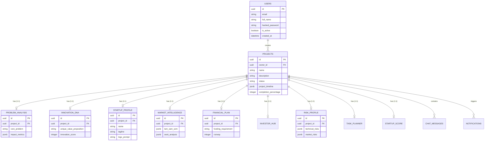

# NOVA X - Entity Relationship Diagram

```mermaid
erDiagram
    USERS ||--o{ PROJECTS : creates
    PROJECTS ||--o| PROBLEM_ANALYSIS : "has (1:1)"
    PROJECTS ||--o| INNOVATION_DNA : "has (1:1)"
    PROJECTS ||--o| STARTUP_PROFILE : "has (1:1)"
    PROJECTS ||--o| MARKET_INTELLIGENCE : "has (1:1)"
    PROJECTS ||--o| FINANCIAL_PLAN : "has (1:1)"
    PROJECTS ||--o| INVESTOR_HUB : "has (1:1)"
    PROJECTS ||--o| RISK_PROFILE : "has (1:1)"
    PROJECTS ||--o| TASK_PLANNER : "has (1:1)"
    PROJECTS ||--o| STARTUP_SCORE : "has (1:1)"
    PROJECTS ||--o{ CHAT_MESSAGES : "contains"
    PROJECTS ||--o{ NOTIFICATIONS : "triggers"

    USERS {
        uuid id PK
        string email
        string full_name
        string hashed_password
        boolean is_active
        datetime created_at
    }

    PROJECTS {
        uuid id PK
        uuid owner_id FK
        string name
        string description
        string status
        jsonb project_timeline
        integer completion_percentage
    }

    PROBLEM_ANALYSIS {
        uuid id PK
        uuid project_id FK
        string core_problem
        jsonb impact_metrics
    }

    INNOVATION_DNA {
        uuid id PK
        uuid project_id FK
        string unique_value_proposition
        integer innovation_score
    }
    
    STARTUP_PROFILE {
        uuid id PK
        uuid project_id FK
        string name
        string tagline
        string logo_prompt
    }

    MARKET_INTELLIGENCE {
        uuid id PK
        uuid project_id FK
        jsonb tam_sam_som
        jsonb swot_analysis
    }

    FINANCIAL_PLAN {
        uuid id PK
        uuid project_id FK
        string funding_requirement
        integer runway
    }

    RISK_PROFILE {
        uuid id PK
        uuid project_id FK
        jsonb technical_risks
        jsonb market_risks
    }
```
