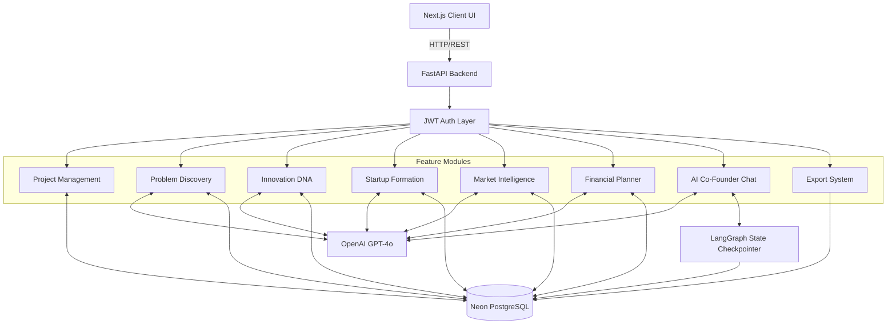

# NOVA X - System Architecture Diagram

```mermaid
graph TD
    %% User Interfaces
    Client[Next.js Client UI]
    
    %% API Gateway & Auth
    subway[FastAPI Backend]
    Auth[JWT Auth Layer]
    
    %% Backend Modules
    subgraph Feature Modules
        PM[Project Management]
        PD[Problem Discovery]
        ID[Innovation DNA]
        SF[Startup Formation]
        MI[Market Intelligence]
        FP[Financial Planner]
        CH[AI Co-Founder Chat]
        EX[Export System]
    end
    
    %% Third-party / External
    LLM[OpenAI GPT-4o]
    LangGraph[LangGraph State Checkpointer]
    
    %% Database
    DB[(Neon PostgreSQL)]
    
    %% Flows
    Client -->|HTTP/REST| subway
    subway --> Auth
    Auth --> PM
    Auth --> PD
    Auth --> ID
    Auth --> SF
    Auth --> MI
    Auth --> FP
    Auth --> CH
    Auth --> EX
    
    PD <--> LLM
    ID <--> LLM
    SF <--> LLM
    MI <--> LLM
    FP <--> LLM
    
    CH <--> LLM
    CH <--> LangGraph
    LangGraph --> DB
    
    PM <--> DB
    PD <--> DB
    ID <--> DB
    SF <--> DB
    MI <--> DB
    FP <--> DB
    EX --> DB
```
